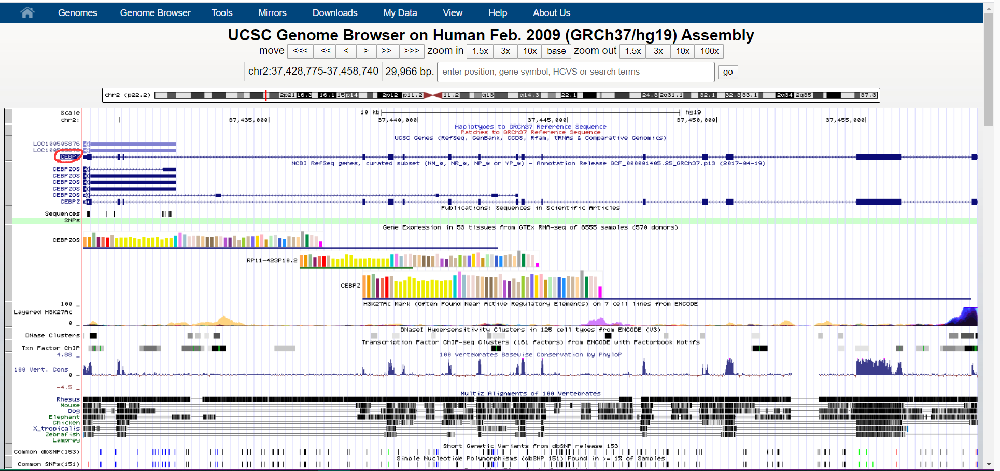

# Homework 1

**这个作业的主要难点在于第三道题。**

> 3. Please search for the uc002rpz.3 transcript in the UCSC genome browser (hg19) and respond to following instructions or questions.
>     • Extract this transcript as BED12 format (5’) 
>
>   • Number of isoforms (from UCSC Genes annotation) (5’) （isoform代表Alternative Splicing的结果）
>
>    • Chromosome (5’) 
>
>   • Strand (5’) 
>
>   • Exon number (5’) 
>
>   • mRNA length (5’) 
>
>   • TSS position (5’) 
>
>   • CDS end site position (5’) 
>
>   • CDS length (hint: not including introns) (5’) 
>
>   • Extract CDS protein sequence (5’) • Extract the sequence of the exon 12 (5’), highlight this block (5’) and take a screenshot as pdf format (5’)
>   • Get all transcript IDs within 100,000 bp upstream of this transcript TSS (UCSC Genes annotation) (5’)


点击搜索之后会遇到满屏幕的信息无从下手，仔细观察后我们点击红色圆圈部分，找到GO Annotation，这里我们可以查询到它的isoform信息，在这个例子中它只有一种剪切方式，随意第二问回答1.   



找到 **table browser**  选择 get output —> get BED，这样我们可以得到这个基因的BED12信息：


> ```
> chr2        37428774        37458740        uc002rpz.3        0        -        37428906        37458710        0        16        272,82,59,84,197,58,98,67,69,103,54,89,184,232,1493,186,        0,1152,1318,9367,10211,10703,12232,13254,14508,14684,15352,18753,20748,21538,25912,29780,
> ```

BED12 其实是BED3 加上九个可选阈

> **About BED format**
>
> 1. **chrom** – The name of the chromosome (e.g. chr3, chrY, chr2_random) or scaffold (e.g. scaffold10671).
> 2. **chromStart** – The starting position of the feature in the chromosome or scaffold. The first base in a chromosome is numbered 0.
> 3. **chromEnd** – The ending position of the feature in the chromosome or scaffold. The *chromEnd* base is not included in the display of the feature, however, the number in position format. will be represented. For example, the first 100 bases of chromosome 1 are defined as *chrom=1, chromStart=0, chromEnd=100*, and span the bases numbered 0-99 in our software (not 0-100), but will represent the position notation chr1:1-100. 
>
> The 9 additional optional BED fields are:
>
> 1. **name** – Defines the name of the BED line. This label is displayed to the left of the BED line in the Genome Browser window when the track is open to full display mode or directly to the left of the item in pack mode.
> 2. **score** – A score between 0 and 1000. If the track line *useScore* attribute is set to 1 for this annotation data set, the *score* value will determine the level of gray in which this feature is displayed (higher numbers = darker gray). This table shows the Genome Browser’s translation of BED score values into shades of gray:
> 3. **strand** – Defines the strand. Either “.” (=no strand) or “+” or “-“.
> 4. **thickStart** – The starting position at which the feature is drawn thickly (for example, the start codon in gene displays). When there is no thick part, thickStart and thickEnd are usually set to the chromStart position.
> 5. **thickEnd** – The ending position at which the feature is drawn thickly (for example the stop codon in gene displays).
> 6. **itemRgb** – An RGB value of the form R,G,B (e.g. 255,0,0). If the track line *itemRgb* attribute is set to “On”, this RBG value will determine the display color of the data contained in this BED line. NOTE: It is recommended that a simple color scheme (eight colors or less) be used with this attribute to avoid overwhelming the color resources of the Genome Browser and your Internet browser.
> 7. **blockCount** – The number of blocks (exons) in the BED line.
> 8. **blockSizes** – A comma-separated list of the block sizes. The number of items in this list should correspond to *blockCount*.
> 9. **blockStarts** – A comma-separated list of block starts. All of the *blockStart* positions should be calculated relative to *chromStart*. The number of items in this list should correspond to *blockCount*.

值得特别关注的有三点：

+ thickStart  和 thickEnd 两项常常被用于表示外显子
+ 总是要关注什么时候是以0为起始，什么时候是以1为起始（这个对于作业没那么重要）
+ 区间总是左闭右开的。

我们可以根据bed12上的信息直接回答这个基因在哪个染色体上，编码基因的方向和refSeq方向（+还是-），外显子的数量（Block count） mRNA的长度（是把blockSizes中的十六个数字相加） TSS也就是转录起始位点，由于是负链，所以和chrom-end是一样的。

这里有一个trick ，虽然bed12中的chrom-end是0 based，但是一旦我们在正常的交流中讨论这个问题，比如说这里我们问他的转录起始位点，这个情况要根据人们的生活习惯来，将编码方式变为1 based，所以在这个例子中，TSS是37458740 而不是 37458739 。 与此相似的，我们可以回答CDS end site 应该是37428907而不是37428906 。

CDS length的计算利用了Thick end和Thick start：

最后，ProteinSequence，BlockSequence和ExpandIDs都可以利用Table browser查询得到。

-(ChromEnd - ThickEnd)\\&=3327 -132-30\\&=3165\\end{align})