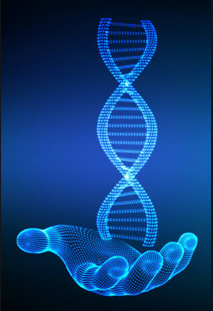

# Genomics

**Homework solutions for Genomics by ZY in Wuhan University**

这里我们总结了2019年周《基因组学》的作业内容。并对其中一些有点难度的问题进行了解答。

## Homework1

关于UCSC genome browser的使用和bed12 format 的相关内容

## Homework2

关于测序的相关内容，包括：

+ Sanger测序读胶
+ 序列组装
+ K-mer深度的分析
+ Rfam数据库的运用。

## Homework3

还是测序的相关内容，包括：

+ 隐马尔可夫链（HMM）与剪切位点的预测
+ 特殊的测序技术（如m6A-seq、icSHAPE 、PARIS等）

## Homework4

数据分析的有关内容，包括：

+ 利用动态规划算法进行DNA序列比对
+ 基因组伦理学的相关内容

## Homework5

笔记整理，选取六次上交